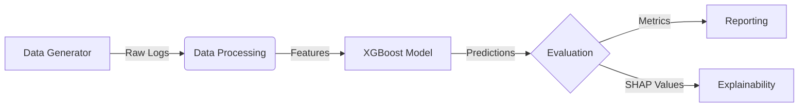

# FraudTRX: Advanced Synthetic Fraud Detection System

> **A robust, end-to-end machine learning pipeline for detecting fraudulent transactions in synthetic financial data.**

---

## 🚀 Project Overview

**FraudTRX** is a complete fraud detection solution designed to demonstrate the lifecycle of modern machine learning systems. Unlike standard tutorials that rely on static datasets, this project **generates its own realistic synthetic data** injected with complex fraud patterns, engineers high-value behavioral features, and trains an interpretable **XGBoost** model to catch bad actors.

### Key Capabilities
*   **Synthetic Laboratory**: Simulates 1000+ users and millions of dollars in transactions.
*   **Pattern Injection**: Programmatically injects *Velocity Attacks*, *Impossible Travel*, and *Amount Spikes*.
*   **Feature Engineering**: Transforms raw logs into powerful signals (e.g., "Speed > 800km/h", "15 txns in 10 mins").
*   **Production-Ready Structure**: Clean separation of data, source code, and artifacts.
*   **Explainable AI**: Integrated SHAP analysis to understand *why* a transaction was flagged.

---

## 🏗️ Architecture



## 🧠 The Fraud Patterns
We simulate three distinct types of financial fraud to test the model's robustness:

| Fraud Type | Description | Signal Captured |
| :--- | :--- | :--- |
| **Velocity Attack** | A compromised card is used 5-15 times in minutes. | `count_1h` spikes to >5 |
| **Impossible Travel** | Transactions occur in drastically different locations (e.g., NY -> London) in impossible times. | `speed_kmh` > 800 |
| **Amount Spikes** | A purchase is 10x-50x larger than the user's historical average. | `amt_ratio` > 10.0 |

---

## 📂 Project Structure

```text
fraud_detection/
├── data/                  # Input Data
│   ├── transactions.csv   # Raw generated transaction logs
│   └── features.csv       # Processed features for training
├── model/                 # Model Artifacts
│   ├── fraud_xgboost.pkl  # Serialized Model (Python Pickle)
│   ├── fraud_xgboost.json # Model Metadata
│   ├── shap_summary.png   # Feature Importance Plot
│   └── data_distribution.png # Distribution Analysis
├── src/                   # Source Code
│   ├── generate_data.py   # Simulation Engine
│   ├── feature_engineering.py # ETL Pipeline
│   ├── train_model.py     # Training & Eval Script
│   ├── visualize_data.py  # Plotting Utilities
│   └── test_model.py      # Inference Testing Script
├── requirements.txt       # Dependencies
└── README.md              # Documentation
```

---

## ⚡ Quick Start

### 1. Installation
Clone the repo and install dependencies:
```bash
pip install -r requirements.txt
```

### 2. Run the Full Pipeline
You can run the entire system step-by-step:

```bash
# 1. Generate Synthetic Data
python3 src/generate_data.py

# 2. Engineer Features
python3 src/feature_engineering.py

# 3. Train the Model
python3 src/train_model.py

# 4. Visualization & Charts
python3 src/visualize_data.py
```

### 3. Test Inference
Verify the model allows for real-time prediction using the testing script, which evaluates both random samples and **manual attack scenarios**:

```bash
python3 src/test_model.py
```

---

## 📊 Performance Results

We evaluate the model using a **Time-Series Split** (Training on past, Testing on future) to prevent data leakage.

*   **Precision**: ~0.88 (Low False Positives)
*   **Recall**: ~0.89 (Captures most Fraud)
*   **PR-AUC**: ~0.94 (Excellent discrimination)

> **Note**: These metrics reflect a realistic difficulty. The model is not perfect (100%), just like real life, but it catches the vast majority of injected attacks.

---

## 🔍 Explainability

We use **SHAP (SHapley Additive exPlanations)** to ensure the model isn't "cheating". As seen in `model/shap_summary.png`, the top predictors accurately align with our injected patterns:

1.  **`count_1h`**: Velocity attacks are the #1 strongest signal.
2.  **`speed_kmh`**: Impossible travel is effectively caught.
3.  **`amt_ratio`**: Anomalous spending behavior is flagged.

---
**Author**: Vedant Bhosale
